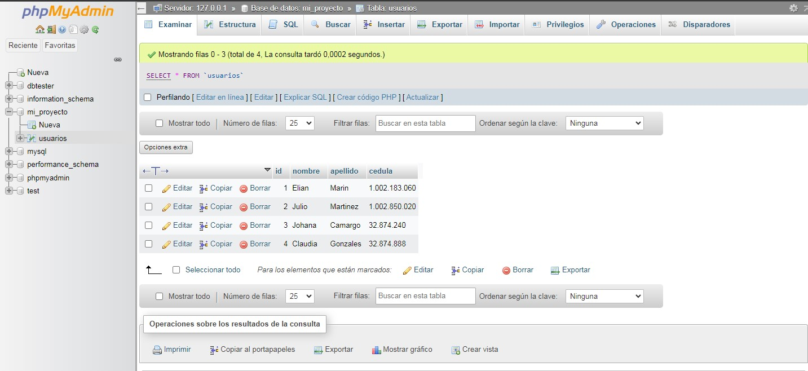
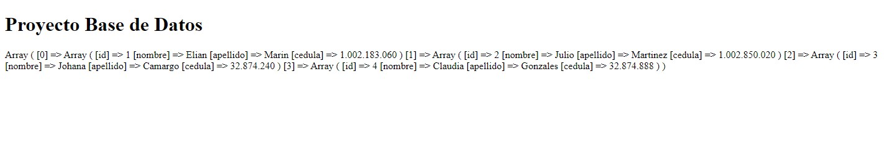
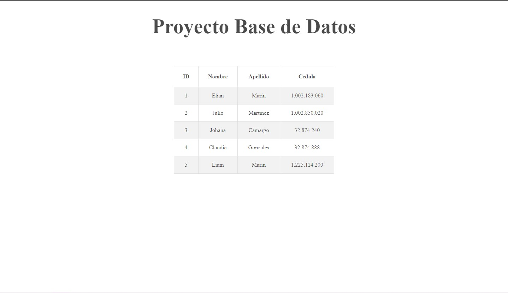

<h1> Taller 10: Elian Marin</h1>

<h2>Informacion</h2>

Curso: Full Stack Basico - Grupo 1

Profesor: Cristian Patiño

<h2> Punto 1: </h2>

<h2> Punto 2: </h2>

<h2> Punto 3: </h2>

<h2> Punto 4: </h2>

<h2> Punto 5-6-7: </h2>
<h3>5 - Base de datos</h3>

<h3>6 - Conexion Base de datos</h3>

<h3>7 - Muestra en pantalla</h3>

